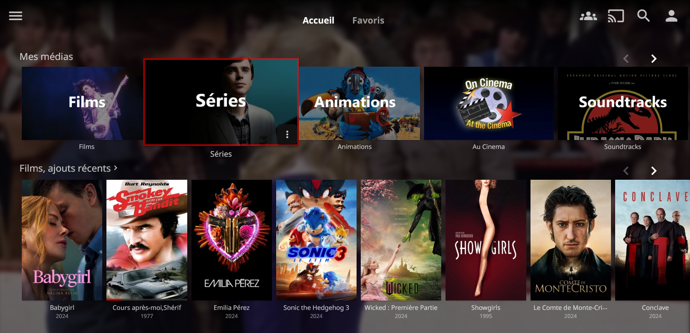
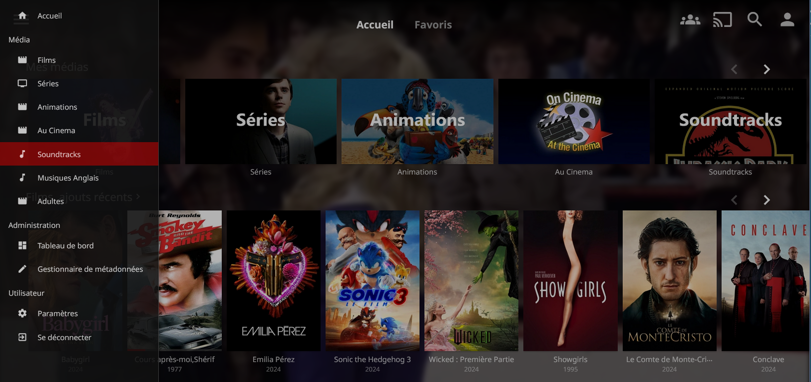

# zoomy
Jellyfin theme
Compatible with 10.10.3

### *** Screenshots ***





### *** Installation ***

To add the theme to Jellyfin, copy the following line to User/Display/Custom CSS code
```
@import url('https://github.com/sheerdagy/zoomy/theme.css');
```